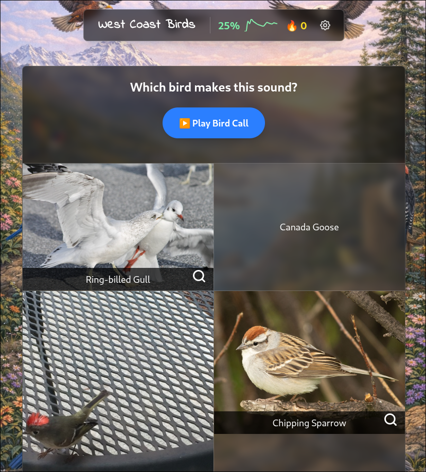

# Bird Quiz

A multi-modal bird identification quiz app for learning to recognize North American birds by sight and sound.



## Features

- **Multi-modal questions**: Identify birds by photo, audio call, or both
- **Multiple answer formats**: Text, photo, or audio answer options
- **Region-based learning**: Focus on birds from specific regions (Pacific Northwest, Eastern US, Southwest, etc.)
- **Progress tracking**: Rolling accuracy stats and streak tracking
- **Offline-ready**: All bird data, photos, and audio cached locally
- **80+ bird species** across 6 North American regions

## Quick Start

```bash
cd web
npm install
npm run dev
```

Open http://localhost:5173/

## Tech Stack

- **Frontend**: React + TypeScript + Vite
- **Styling**: Tailwind CSS
- **Data**: Static JSON dataset with cached media files

## Project Structure

```
bird-quiz/
├── data/
│   ├── birds.json      # Bird species data
│   ├── regions.json    # Region definitions
│   ├── photos/         # Cached bird photos
│   └── audio/          # Cached audio recordings
├── web/                # React frontend
│   └── src/
│       ├── components/ # UI components
│       ├── hooks/      # Custom React hooks
│       └── utils/      # Utility functions
└── scripts/            # Python data collection pipeline
```

## Data Sources & Attribution

This app uses openly licensed content from:

### Xeno-canto (xeno-canto.org)
- Audio recordings of bird calls and songs
- Licensed under CC BY-NC-SA
- Individual recordist attribution included in app

### iNaturalist (inaturalist.org)
- Research-grade bird photographs
- Licensed under CC BY-NC / CC BY-NC-SA
- Photographer attribution included in app

### Wikipedia
- Species descriptions
- Licensed under CC BY-SA

## Data Collection

The dataset can be refreshed using Python scripts:

```bash
cd scripts/
python3 fetch_birds.py --test  # Test with 3 species
python3 fetch_birds.py         # Full collection
```

See [PIPELINE.md](PIPELINE.md) for complete CRUD documentation.

## License

MIT
